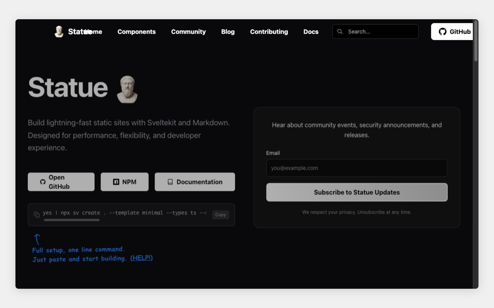

# ChromeRPC

gRPC adapters over the [Chrome DevTools Protocol](https://chromedevtools.github.io/devtools-protocol/):
every CDP domain (**54** of them) is exposed as its own gRPC service, so you can
drive a real Chrome — navigate, screenshot, evaluate JS, intercept network, inspect
the DOM — over gRPC, locally or as a hosted Cloud Run service. A higher-level
automation surface and an interactive session proxy sit on top.

> **Under active refactor.** Architecture, tooling, and docs are being reworked;
> coordination and status live in [`docs/refactor/`](docs/refactor/). The custom
> automation API described below is being replaced (see the refactor roadmap).

## Quick start (local)

```bash
make dev     # go run the server: launches headless Chrome + gRPC on :50051
```

Requires a local Chrome/Chromium (`brew install --cask google-chrome` on macOS).
Or connect to an existing Chrome with remote debugging — see
[Connecting to an existing Chrome](#connecting-to-an-existing-chrome).

## Low-Level CDP Interface (all domains)

Every Chrome DevTools Protocol domain is exposed as its own gRPC service —
`cdp.page.PageService`, `cdp.runtime.RuntimeService`, `cdp.network.NetworkService`,
`cdp.dom.DOMService`, `cdp.input.InputService`, `cdp.target.TargetService`, and ~50
more. Each method maps 1:1 to a CDP command (e.g. `PageService.CaptureScreenshot`,
`NetworkService.SetCookie`, `RuntimeService.Evaluate`).

**gRPC reflection is enabled**, so you can discover the full surface without any
local `.proto` files. Capabilities are **methods**, not services — listing services
only gives you the ~54 domains; the actual commands live in the methods *inside*
each service. Discovery has three levels:

```bash
grpcurl $ADDR list                                          # 1. all ~54 services (domains)
grpcurl $ADDR list cdp.network.NetworkService               # 2. that domain's methods = capabilities
grpcurl $ADDR describe cdp.network.NetworkService.SetCookie # 3. a method's request/response
grpcurl $ADDR describe cdp.network.SetCookieRequest         #    a message's fields
```

To dump **every** method across every domain (the whole capability list):

```bash
for s in $(grpcurl $ADDR list | grep '^cdp\.'); do grpcurl $ADDR list "$s"; done
```

(Locally use `grpcurl -plaintext localhost:50051 …`; on Cloud Run add `-H "$AUTH"`
and target `$HOST:443` — see below.)

The low-level domain services currently share the **process-wide default session**
and are **not** per-call isolated, so they're best for single-session or local use.
For isolated, concurrency-safe automation, use the higher-level automation surface.

## Automation

A higher-level `HeadlessBrowserService` runs a **sequence of steps** (navigate,
wait, click, type, screenshot, evaluate, …) as a single RPC, each call isolated in
its own browser context. See [`recipes/`](recipes/) for ready-to-run playbooks and
[`recipes/README.md`](recipes/README.md) for the step building blocks.

> This custom automation API is being replaced during the refactor by a new
> implementation under `proto/chromescript/`; the interactive session service moves
> to `proto/chromerun/`. Prefer it for now, but expect the surface to change.

## Interactive sessions & chrome-proxy

For long-lived, human/agent-in-the-loop steering of a single persistent browser
session (bidi streaming), see [`chrome-proxy/`](chrome-proxy/) — a local HTTP
gateway that holds one interactive session open and exposes a click-through capture
console. Its design notes cover the mandatory gRPC keepalive and the CAPTCHA
human-handoff pattern.

## Running on Cloud Run

chromerpc ships as a self-contained container (Go server + bundled
`google-chrome-stable`) and runs on Google Cloud Run as a hosted gRPC service with
reflection enabled. Full deployment guide — image/version tagging, IAM, scaling,
knobs, and the dev workflow — is in [`docs/deploy.md`](docs/deploy.md).

```bash
gcloud auth login
gcloud config set project <YOUR_PROJECT>
make deploy            # Cloud Build -> Artifact Registry -> Cloud Run (IAM-gated)
```

`make deploy` deploys **IAM-gated** (`INVOKER_AUTH=require`). The bare
`scripts/deploy-cloudrun.sh` defaults to `INVOKER_AUTH=allow` (public) unless you
set `INVOKER_AUTH=require` — a public browser-automation endpoint is effectively an
open fetch/SSRF proxy, so gate it. Services scale to zero (**never** set
`--min-instances` above 0).

### Calling the deployed service

Set the endpoint and a token once (the principal must have `roles/run.invoker`):

```bash
HOST=$(gcloud run services describe chromerpc --region us-central1 \
        --format='value(status.url)'); HOST=${HOST#https://}
TOKEN=$(gcloud auth print-identity-token)
AUTH="authorization: Bearer ${TOKEN}"
```

**Discover the API** (reflection is on — no local `.proto` needed):

```bash
grpcurl -H "$AUTH" $HOST:443 list
grpcurl -H "$AUTH" $HOST:443 describe cdp.page.PageService
```

**Run an automation and save the screenshot** (PNG bytes come back inline in
`stepResults[].screenshotData`, base64):

```bash
grpcurl -H "$AUTH" -d '{
  "steps": [
    { "navigate": { "url": "https://example.com", "wait_until": "networkidle" } },
    { "screenshot": { "format": "png" } }
  ]
}' $HOST:443 cdp.headlessbrowser.HeadlessBrowserService/RunAutomation \
  | jq -r '.stepResults[]|select(.screenshotData).screenshotData' \
  | base64 -d > out.png && open out.png
```

**Grant another caller** access:

```bash
gcloud run services add-iam-policy-binding chromerpc --region us-central1 \
  --member 'user:someone@example.com' --role roles/run.invoker
```

### Calling from code (Go)

Any gRPC client works — point it at `HOST:443` with **TLS** and attach a **bearer
identity token per call** (use the service URL as the token audience):

```go
import (
    "crypto/tls"
    "google.golang.org/grpc"
    "google.golang.org/grpc/credentials"
    "google.golang.org/grpc/credentials/oauth"
    "google.golang.org/api/idtoken"
    pagepb "github.com/accretional/chromerpc/proto/cdp/page"
)

audience := "https://" + host // the Cloud Run service URL
ts, _ := idtoken.NewTokenSource(ctx, audience)        // service-account or ADC creds
conn, _ := grpc.NewClient(host+":443",
    grpc.WithTransportCredentials(credentials.NewTLS(&tls.Config{})),
    grpc.WithPerRPCCredentials(oauth.TokenSource{TokenSource: ts}))
defer conn.Close()

client := pagepb.NewPageServiceClient(conn)
// ... call any CDP method, e.g. client.CaptureScreenshot(ctx, &pagepb.CaptureScreenshotRequest{...})
```

For other languages: open a TLS channel to `:443` and send an
`authorization: Bearer <id-token>` metadata header on each RPC.

## Connecting to an existing Chrome

For sites with bot detection, connect to a real (non-headless) Chrome instead of
launching headless:

```bash
"/Applications/Google Chrome.app/Contents/MacOS/Google Chrome" \
  --remote-debugging-port=9222 &
WS_URL=$(curl -s http://127.0.0.1:9222/json/version | python3 -c \
  "import sys,json; print(json.load(sys.stdin)['webSocketDebuggerUrl'])")
./bin/chromerpc --ws-url "$WS_URL"
```

The server passes `--disable-blink-features=AutomationControlled` by default and
supports `--user-agent` overrides. (Headless Chrome still trips some bot walls — the
real-Chrome path is the reliable workaround.)

## Chrome Testing

The [`chrome-testing/`](chrome-testing/) folder is a self-contained, portable
screenshot testing module — build, launch Chrome, serve HTML, capture PNGs, tear
down — in a single script:

```bash
./chrome-testing/snap.sh my-page.html screenshots/my-page.png
```

See [`chrome-testing/USAGE_INSTRUCTIONS.md`](chrome-testing/USAGE_INSTRUCTIONS.md)
for the full guide, including how any other project can copy this folder for its own
visual validation.



## Resources / Notes

- Node.js chrome-remote-interface: https://github.com/cyrus-and/chrome-remote-interface
- **VERY USEFUL** — the full CDP definitions:
  [`browser_protocol.json`](https://github.com/ChromeDevTools/devtools-protocol/blob/master/json/browser_protocol.json)
  + `js_protocol.json` (the source for generating `.proto` from CDP — see the
  Phase-3 refactor plan).
- Programmatic descriptor tooling for CDP→`.proto` generation:
  [buf descriptors](https://buf.build/docs/reference/descriptors/#what-are-descriptors),
  [descriptor.proto](https://github.com/protocolbuffers/protobuf/blob/main/src/google/protobuf/descriptor.proto),
  [protoreflect](https://pkg.go.dev/google.golang.org/protobuf/reflect/protoreflect),
  [protoprint](https://github.com/jhump/protoreflect/tree/main/protoprint).
