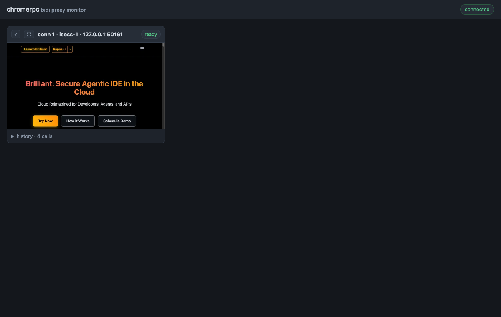
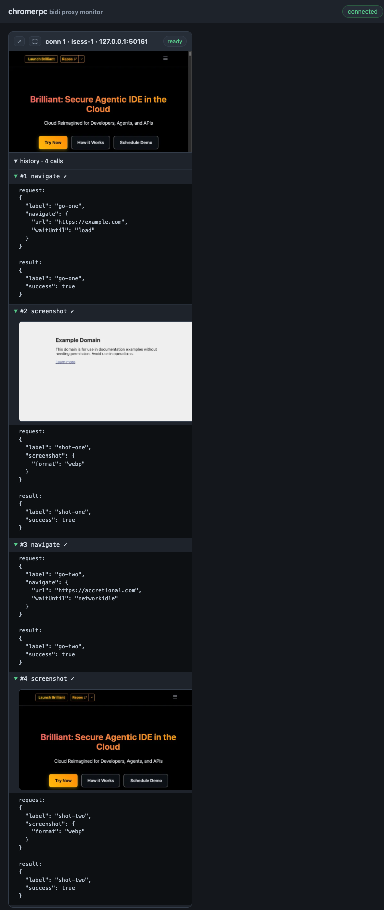
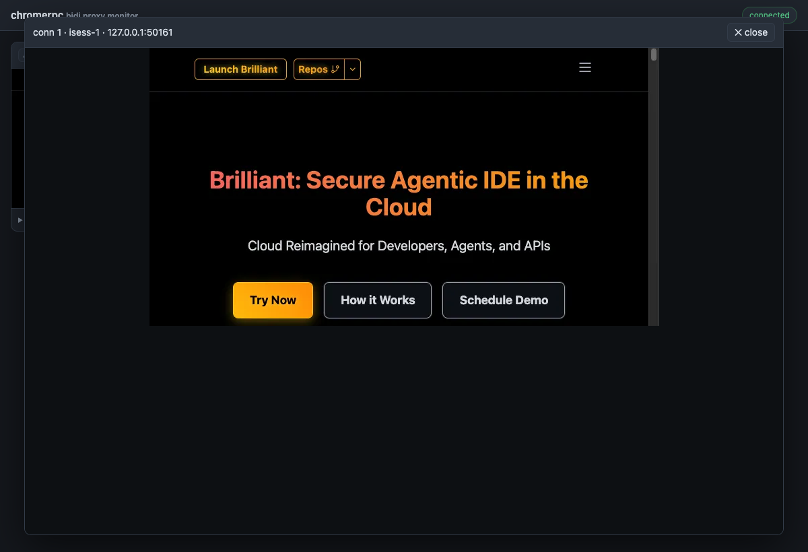

# chrome-proxy — steerable interactive session proxy

`chrome-proxy` holds **one** interactive bidi `Session` open to a remote
chromerpc service and fronts it with a tiny local HTTP API, so a caller that can
only make independent one-shot requests — a human poking `curl`, or an **agent
issuing separate tool calls** — can drive a single *live* browser session
iteratively. The session and its server-side Chrome persist across every call.

## Why this exists

A gRPC **bidirectional stream is one long-lived connection**. The interactive
service keeps per-session browser state (navigation, scroll, cookies, open
checkout flow) for the life of that stream. An agent, though, acts in discrete
steps — look at a screenshot, decide, act — each a separate process. It can't
hold the stream itself. `chrome-proxy` is the long-lived holder: it owns the
stream and exposes a request/response surface the agent *can* use.

## API

```
POST /steps   body: {"steps":[<AutomationStep protojson>, ...]}  (or a bare [...])
              runs the steps in order on the open session, returns each result,
              and writes any screenshot bytes to <shots>/NNNN-<label>.png
              (the JSON carries the file path + size, not the blob)
GET  /health  liveness
POST /close   close the session and exit
```

A step is one `cdp.headlessbrowser.AutomationStep` in protojson:

```bash
curl -s localhost:8099/steps -d '{"steps":[
  {"navigate":{"url":"https://example.com","wait_until":"networkidle"}},
  {"screenshot":{"format":"png"}},
  {"evaluate_script":{"expression":"document.title"}}
]}'
```

The agent loop: `POST /steps` → read the saved screenshot → decide → `POST /steps`
again. State carries over because it's the same session.

## Run

```bash
go run ./chrome-proxy \
  -addr <service-host>:443 -tls \
  -token "$(gcloud auth print-identity-token)" \
  -listen 127.0.0.1:8099 -shots redsocks-test/shots
```

## Monitoring dashboard

A **read-only** web dashboard for *watching* (not steering) the proxy's live
session. With the proxy running, open it in a browser:

```bash
open "http://127.0.0.1:8099/"      # macOS
```

Each connection is a grid window with its latest capture, state, and a collapsed
call history:



Expanding a window's history shows every gRPC call in order, and each screenshot
call renders its own capture inline — so you can review the captures
**chronologically** (here `example.com`, then `accretional.com`), not just the
latest:



The **⛶** control opens a near-fullscreen viewer of the latest capture:



> These images are generated by [`test.sh`](./test.sh), so they always reflect the
> current implementation.

Each connection the proxy holds is a grid **window** showing its latest capture,
its state (`connecting`/`ready`/`closed`/`errored`), and a default-closed,
expandable history of the gRPC calls made over it (each call expands to its full
request/result; a screenshot call also renders its capture inline, so the history
is a chronological sequence of captures). Two pure-CSS controls per window:

- **⤢** enlarges the window within the grid (a `<label>` toggling a hidden
  checkbox; `:has(.sizer:checked)` widens the cell).
- **⛶** opens a near-fullscreen viewer of the latest capture (a `#conn-N` link
  that `:target` styles as an overlay). `✕ close` dismisses it.

**How it works.** The page (`monitor.html`) is one static file embedded with
`go:embed`; its only script opens a single websocket to `/ws`. On connect the
proxy calls its in-process `ChromeMan.History` — a gRPC server-streaming method
dialed over an in-memory bufconn — and forwards each `ConnectionHistory` message
to the socket as protojson. Streaming is **append-only**: a connection's calls
arrive one at a time and screenshot bytes (a typed `MediaCapture` — webp/png/jpeg,
whatever the session produced) travel exactly once. Navigation, sizing, the modal,
and history expansion are all CSS — JavaScript only relays socket data into the DOM.

**Scope.** This first pass has no mutation surface: `ChromeMan` exposes only
`History`. The dashboard shows whatever the session itself produces (e.g. the
screenshots your steps take) and never injects steps of its own. It is separate
from, and additive to, the `/capture` click-through console below.

Endpoints it adds: `GET /` (dashboard), `GET /ws` (ConnectionHistory over a websocket).

## Design notes / gotchas

- **Keepalive is mandatory.** A long-lived interactive stream sits idle while the
  operator thinks; without gRPC keepalive the HTTP/2 connection is idle-closed
  and the session ends (server sees EOF → recycles its Chrome). The proxy sets
  `keepalive.ClientParameters{Time: 30s, PermitWithoutStream: true}`.
- **One stream, serialized.** `/steps` is mutex-guarded — a bidi stream can't
  interleave concurrent send/recv. Drive one move at a time.
- **Screenshots to disk, not inline.** Bytes are written to `-shots`; the
  response returns the path so logs/agents stay readable.
- **Auth.** The identity token is attached once as stream metadata; the stream
  stays authenticated for its life (tokens last ~1h — fine for a session).

## Relation to generated proxies

This is a focused, hand-written gateway over the *one* RPC we drive
(`InteractiveSessionService.Session`). A general reflection→HTTP gateway —
auto-generating a REST/JSON surface for every reflected gRPC service/method
(e.g. via accretional's `openapi2proto` / `gluon` codegen + `astkit`, or a
reflection-driven `grpc`→`goproxy` client) — would generalize this to the whole
55-domain CDP surface without hand-writing handlers. That generalization is
deferred; for steering a single interactive session, this focused proxy is
enough.

See [`redsocks-test/CLAUDE_RED_SOCKS_TEST.md`](../redsocks-test/CLAUDE_RED_SOCKS_TEST.md)
for a full agent-steered session driven through this proxy.

## Human-in-the-loop click-through (CAPTCHAs, image selection, etc.)

When a live session hits a step that needs human *visual* interaction the agent
can't reliably do — an interactive CAPTCHA puzzle, image selection, a drag — use
the click-through console instead of guessing:

**Workflow (agent runs this on demand):**

```bash
open "http://127.0.0.1:8099/capture"     # macOS; pops the page in the human's browser
```

The human clicks on the live screenshot to solve it; every click (and the Enter
button) is replayed into the *remote* session as a real CDP mouse/key event,
coordinate-mapped to CSS px (`cssX = (clientX-rect.left)/rect.width * X-Css-Width`,
same for Y). The page auto-refreshes (pausing ~4s after a click) so the human
sees each move. Session/Chrome state persists across the handoff (the proxy holds
the bidi stream open, with keepalive).

**Division of labor that works:**
- **Human:** the visual/click part only (solve the CAPTCHA puzzle, pick images).
- **Agent:** drives navigation + fills text fields, including codes the human
  reads out-of-band (email/SMS OTPs). The agent `open`s the capture page exactly
  when a click-solve is needed, and resumes once the human reports it cleared.

Endpoints: `GET /capture` (console), `GET /shot.png` (live PNG + `X-Css-Width/Height`),
`POST /clickxy {x,y}` (replay click), `POST /key {key}` (replay key press).

> Reliability note: the agent should NOT try to solve adversarial CAPTCHAs itself
> (low success + it's circumventing a security control). Hand the *visual* solve
> to the human via this console; keep driving everything else.
